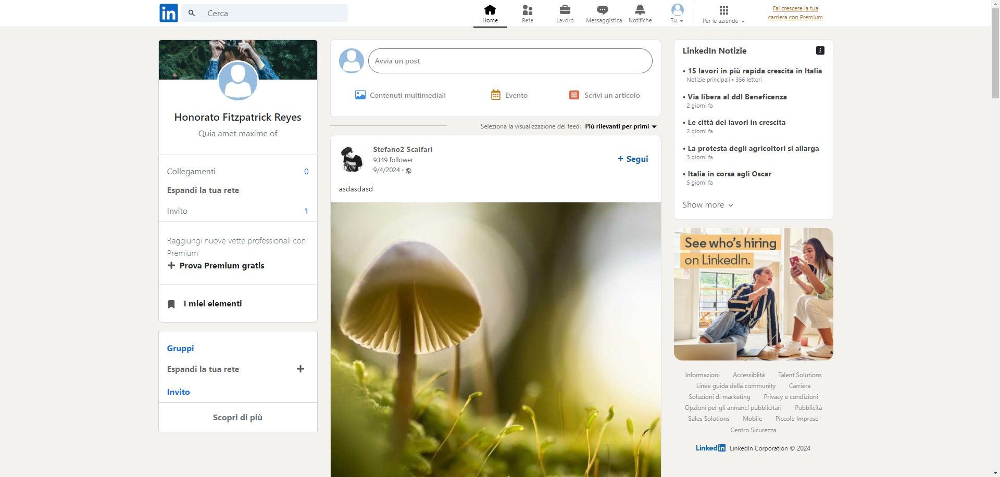

<h1>LinkedIn Clone - Frontend</h1>

  
Questo progetto è un clone semplificato dell'interfaccia utente di LinkedIn, sviluppato con React, Axios e Redux. L'applicazione utilizza chiamate API per recuperare e visualizzare i dati, offrendo un'esperienza simile a LinkedIn per la navigazione dei profili utente e la pubblicazione di post.

  <h2>Caratteristiche principali:</h2>
    <ul>
        <li>Visualizzazione dei profili utente</li>
        <li>Pubblicazione di post</li>
        <li>Feed di post</li>
        <li>Gestione dello stato tramite Redux</li>
        <li>Utilizzo di Axios per le chiamate API</li>
    </ul>

   <h2>Tecnologie utilizzate:</h2>
    <ul>
        <li>React: Libreria JavaScript per la costruzione dell'interfaccia utente.</li>
        <li>Axios: Cliente HTTP per effettuare richieste API.</li>
        <li>Redux: Libreria per la gestione dello stato dell'applicazione.</li>
    </ul>

  <h2>Crediti:</h2>
    
Il frontend del LinkedIn Clone è stato sviluppato con passione da <a href="https://www.linkedin.com/in/trixiamarielorenzana/" target="_blank">Trixia Marie Lorenzana</a>, <a href="https://www.linkedin.com/in/gregorio-vecchio-b709232b0/" target="_blank">Gregorio Vecchio</a>, <a href="https://www.linkedin.com/in/alessandro-dalla-costa-fullstack-developer/" target="_blank">Alessandro Dalla Costa</a>, <a href="https://www.linkedin.com/in/vincenzo-arpaia/" target="_blank">Vincenzo Arpaia</a>, <a href="https://www.linkedin.com/in/francesco-cecca-30696a185/" target="_blank">Francesco Cecca</a> e <a href="https://www.linkedin.com/in/matteo-nardin-fullstack-junior/" target="_blank">Matteo Nardin</a>.

